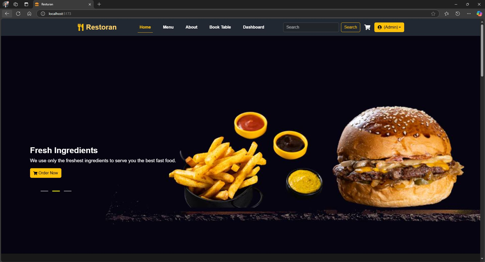
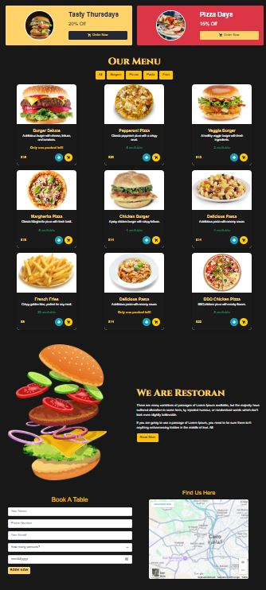
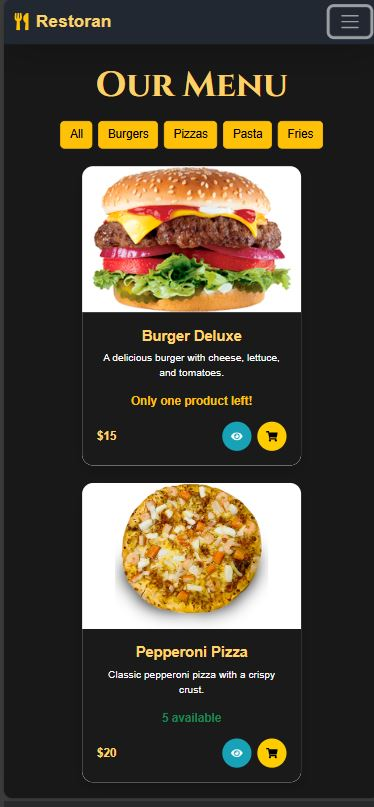
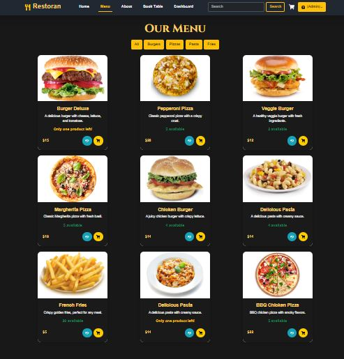

<h1 align="center">🍔 Restaurant</h1>

  A modern and responsive restaurant menu built with <b>React</b> and <b>Bootstrap</b>.  
  Browse different food categories, add items to your cart, and view detailed product information.

---

## 📸 Screenshots  

### 🏠 Home Page  

|   HOME Slider  |
|----------------|
|  |

### 📦 Full Page 
| Laptop View | Mobile View  |
|------------|-----------|
|  |  |
 

### 🛒 Menu  
| Menu Of Resturan|
|------------|
|  |
 
---

---

<h2>🎯 Features</h2>
<ul>
  <li>✔️ User authentication and role-based access control</li>
  <li>✔️ Browse various food categories (Burgers, Pizza, Fries, Pasta)</li>
  <li>✔️ Add/remove items from cart with quantity controls (for authorized users)</li>
  <li>✔️ View product details with dynamic rendering</li>
  <li>✔️ Apply filters based on price, category, and availability</li>
  <li>✔️ Order management system (for Admins)</li>
  <li>✔️ User management system (for Admins)</li>
</ul>

---

<h2>🔐 User Roles & Permissions</h2>

<table>
  <thead>
    <tr>
      <th>Role</th>
      <th>Permissions</th>
    </tr>
  </thead>
  <tbody>
    <tr>
      <td><b>👤 Anonymous User</b></td>
      <td>
        ❌ Cannot add items to cart 
        ❌ Cannot place orders 
        ✅ Can browse menu and view product details
      </td>
    </tr>
    <tr>
      <td><b>🛒 Registered User</b></td>
      <td>
        ✅ Can browse menu and view product details 
        ✅ Can add/remove items from cart 
        ✅ Can place orders 
        ❌ Cannot manage users or products
      </td>
    </tr>
    <tr>
      <td><b>🛠️ Admin</b></td>
      <td>
        ✅ Full access to menu and orders 
        ✅ Can add, edit, and delete products 
        ✅ Can manage user accounts (add, remove, block) 
        ✅ Can manage orders and table reservations 
        ✅ Can view all sales reports and statistics
      </td>
    </tr>
  </tbody>
</table>

---

<h2>🛠️ Tech Stack</h2>
<h3>Frontend</h3>
<ul>
  <li>HTML, CSS, JavaScript</li>
  <li>React.js</li>
  <li>Bootstrap</li>
  <li>FontAwesome</li>
</ul>

<h3>Backend</h3>
<ul>
  <li>JSON Server (Mock API for development)</li>
</ul>

---

